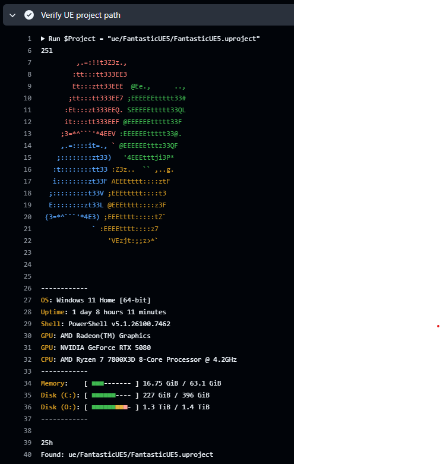
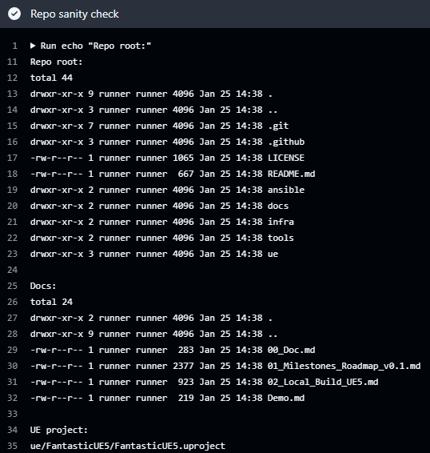
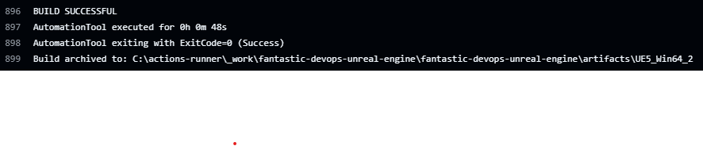
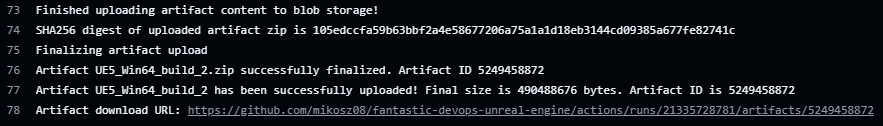

# Demo (5 min)

Fastest way to verify the project: **CI build → artifact → monitoring → docs**.

---

## 1) CI/CD Preview
**Verify self-hosted runner UR project path**

**Repo sanity check**

**UE5 build success**

**Artifact uploaded**

